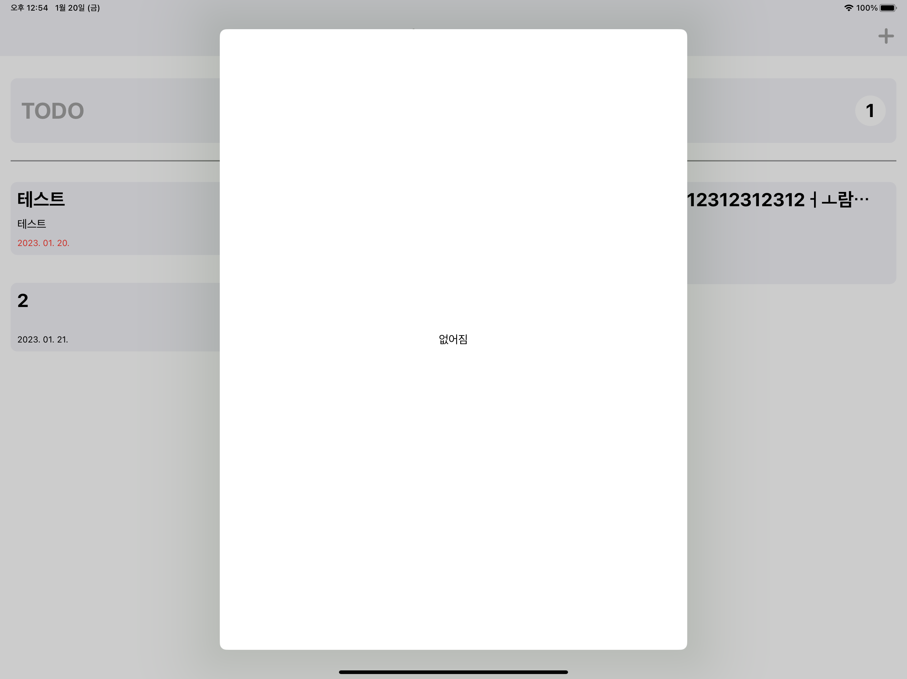

# 프로젝트 매니저

- 칸반 형태의 대시 보드를 통해서 프로젝트를 관리할 수 있는 앱입니다.

## 📖 목차
1. [팀 소개](#-팀-소개)
2. [개발 환경 및 라이브러리](#-개발환경-및-라이브러리)
3. [기능 소개](#-기능-소개)
4. [Diagram](#-diagram)
5. [폴더 구조](#-폴더-구조)
6. [타임라인](#-타임라인)
7. [프로젝트에서 경험하고 배운 것](#-프로젝트에서-경험하고-배운-것)
8. [트러블 슈팅](#-트러블-슈팅)
9. [참고 링크](#-참고-링크)

## 🌱 팀 소개
 |[미니](https://github.com/leegyoungmin)|
 |:---:|
| <a href="https://github.com/leegyoungmin"></a>|

## 💾 개발환경 및 라이브러리
### UI


### Architecture


### DataBase
  

## 🛠 기능 소개
### 1. 인증 시스템
#### 1 - 1 로그인


#### 1 - 2 회원가입


### 2. 프로젝트 관리
#### 2 - 1 데이터 생성


#### 2 - 2 데이터 상태 변경


#### 2 - 3 데이터 삭제


#### 2 - 4 데이터 업데이트


## 👀 Diagram


## 🗂 폴더 구조
```bash
├── App
│   ├── AppView
│   │   ├── AppCore.swift
│   │   └── ProjectManagerAppView.swift
│   ├── NetworkManager.swift
│   └── ProjectManagerApp.swift
├── AuthScene
│   ├── AuthCore.swift
│   ├── AuthScene.swift
│   ├── SignInView
│   │   ├── SignInCore.swift
│   │   └── SignInView.swift
│   └── SignUpView
│       ├── SignUpCore.swift
│       └── SignUpView.swift
├── BoardScene
│   ├── BoardScene.swift
│   ├── BoardSceneCore.swift
│   ├── BoardListView
│   │   ├── BoardListComponents.swift
│   │   ├── BoardListCore.swift
│   │   └── BoardListView.swift
│   ├── BoardView
│   │   ├── BoardCore.swift
│   │   └── BoardView.swift
│   ├── DetailBoardView
│   │   ├── DetailCore.swift
│   │   └── DetailView.swift
│   └── NavigationView
│       ├── NavigationBarCore.swift
│       └── NavigationBarView.swift
├── Clients
│   ├── AuthClient.swift
│   ├── ProjectsClient.swift
│   ├── CoreDataManager
│   │   ├── CoreDataManager.swift
│   │   └── Models
│   │       ├── Assignment+CoreDataClass.swift
│   │       └── Assignment+CoreDataProperties.swift
│   └── Proxy
│       ├── ProjectProvider + FireStore.swift
│       └── ProjectProvider.swift
├── Model
│   ├── Project+Providable.swift
│   ├── Project.swift
│   └── User.swift
└── Utility
    ├── Color.swift
    ├── Date.swift
    ├── Font.swift
    ├── Image.swift
    └── TextField.swift
```
## 🕰️ 타임라인
|날짜|구현 내용|
|--|--| 
|23. 03. 22|TCA 라이브러리 버전 업데이트 및 기본 설정 변경|
|23. 03. 23 ~ 24|기존 기능 TCA Reducer Protocol에 맞춰서 리팩토링|
|23. 03. 25|Core Data 저장 및 읽기 기능 구현|
|23. 03. 27|FireBase 설치 및 Auth 기능 구현 (회원가입, 로그인)|
|23. 03. 28|Auth 기능 리팩토링|
|23. 03. 29|FireStore 저장 기능 생성|
|23. 03. 31|네트워크 감지 기능 구현|
|23. 04. 04|Core Data와 FireStore 클래스 병합 (Proxy 패턴)|
|23. 04. 07|버그 수정|

## 🤔 고민한 점
### 1. 기술 선정에 대한 고민


1. `SwiftUI`는 `UIKit`과 다르게 선언적 구문을 활용하여 UI를 구성하게 됩니다. 기존의 이벤트 중심 프로그래밍에서 선언적 구문을 활용하기에 코드가 간결해지고, 가독성이 향상되어 개발 기간을 단축시킬 수 있습니다.
2. `SwiftUI`는 데이터에 대한 상태 변경에 따라서 뷰를 다시 재 랜더링하는 구조를 가지고 있습니다. 이는 Binding에 대한 개념이 탑재가 된 것이고, 하나의 원천적인 데이터를 지속적으로 활용할 수 있는 부분이 메모리상에서 성능적 이점을 가지게 됩니다.
3. `SwiftUI`는 코드 작성의 원칙으로 뷰의 계층 구조와 비슷한 형태의 코드를 가질 수 있도록 하였기 때문에 코드 작성 속도가 빠릅니다.
4. 상태 관리 매커니즘을 기반으로 하며, 주어진 상태 객체의 속성이 변경되면, 이를 통해서 뷰를 다시 랜더링 하게됩니다. 뷰가 상태값에 대해서 바인딩을 하기때문에 상태 전달 코드가 줄어들게 됩니다.


다음 아키텍쳐는 ['SwiftUI에서 MVVM을 지양해야 한다.'라고 생각하게 된 이유](https://qiita.com/karamage/items/8a9c76caff187d3eb838) 라는 문서를 읽어보면서 알게 되었습니다. 해당 문서에서 이야기하는 부분은 MVVM을 채택하게 된 이유에 대해서 이야기 하고 있습니다. `MVVM`이란 뷰와 뷰모델이 바인딩이라는 작업을 통해서 상태값에 대한 유연한 업데이트를 하는 것으로 이야기 할 수 있습니다. 하지만, SwiftUI는 View 자체에 이미 바인딩의 기능을 포함하고 있습니다. 즉, `SwiftUI`의 뷰들의 집합만으로도 `ViewModel`이 하던 바인딩의 작업을 수행할 수 있다는 것입니다. 그렇기 때문에 `ViewModel`의 존재 이유가 없어지는 것입니다.

그렇다면, 이런 `MVVM`을 활용하지 않았을 경우에 발생하는 로직의 구분적인 측면에서 의문점이 발생할 것입니다. 규모가 크지 않은 앱의 경우에는 `MV`만으로도 앱을 구성하는 데 문제가 없을 것입니다. 하지만, 대규모의 앱 같은 경우에는 문제점들이 발생하게 될 것입니다. 이를 해결하기 위해서 `MVI`라는 아키텍쳐를 통해서 해결할 수 있습니다.

<image src = "https://i.imgur.com/G9zAssf.png" height = 300/>

MVI 아키텍쳐란 단방향 데이터 아키텍쳐로서 사용자의 이벤트를 받은 뷰가 `Intent`라는 객체에게 전달하여 모델의 상태 값을 변화시키고 이에 대해서 뷰가 업데이트할 수 있도록 하는 것입니다. 하지만, 위와 같은 상황에서 발생하는 사이드 이펙트나 테스트에 용이하기 위해서 추가적인 구조를 형성하고 있는 아키텍쳐인 `TCA`를 채택하였습니다. 

### Reducer의 구조
`Reducer` 들의 구조는 상향식으로 의존을 하는 구조를 구성할 수 밖에 없다. 그렇기 때문에 좋은 구조를 구성하기 위해서는 최대한 작게 만들고, 이들의 조합을 통해서 새로운 `Reducer`를 구성하는 것이 좋다. 그래서 최대한 작은 `Reducer`를 구성하기 위해서 많은 고민을 하게 되었다. 현재는 Board 내의 Project의 상태에 따른 3가지의 코어를 구성하는 방법으로 구성하였다. 하지만, 데이터를 옮기는 과정에서 많은 어려움이 있을 것이라고 생각하였다. 그렇기 때문에 하나의 `Reducer` 로 구성할 수 있도록 고민하게 되었다.

## 🚀 트러블 슈팅

### 시점에 따른 잘못된 화면

<figure>
  
  <figcaption>
    BUG 화면
  </figcaption>
</figure>

해당 버그는 사용자가 버튼을 누르는 시점에 따라서 상태의 변경을 하지 못하는 경우에 발생하게 되었다. `sheet(item:)` 메서드를 통해서 선택된 객체의 `State` 를 생성하는 코드에서 해당 `State` 가 외부적으로 상태가 변경되고, 외부에서 액션의 발생으로 상태를 지우는 것이 문제였다. `ifLetElse` 메서드는 상태의 존재 여부에 따라서 뷰를 다른 뷰를 보여주는 메서드이다. 이 메서드를 사용하면서 해당 메서드의 특성을 고려하지 못한 것 같다.

이를 해결하기 위해서 `sheet(isPresent:)` 메서드를 활용하여서 개별적으로 사용할 수 있는 내부적인 액션을 구현하였다. `State` 내에서 보여주어야 한다는 상태값이 `true`와 `false`로 가지게 되었고, 뷰의 내부에서 `ifLet` 메서드를 통해서 상태값이 있는 경우에 뷰를 보여 줄 수 있게 구현하였습니다.

### TextField의 PlaceHolder 색상 변경하기
`TextField` 내부 `Placeholder` 의 색상을 변경하는 `Modifier` 는 없습니다. 그래서 색상을 변경하기 위해서 많은 시행착오를 하게 되었습니다. 기존에는 `TextEditor` 를 활용하는 방법을 통해서 `Placeholder` 의 해당 State값의 상태를 통해서 `TextField` 대신에 사용하였습니다.

하지만, 이것은 `TextField` 와 동일한 기능을 제공하지 않다 보니 문제들이 발생하게 됩니다. 그래서 `Modifier` 를 구성하는 방법을 찾아보게 되었습니다. `View` 의 `Extension` 을 통해서 `View` 프로토콜이 사용할 수 있는 메서드를 생성하고, 이는 조건을 통해서 해당 값의 Opacity를 조절하도록 하였습니다. 

```swift
extension View {
    func placeholder<Content: View>(
        when shouldShow: Bool,
        alignment: Alignment = .leading,
        @ViewBuilder placeholder: () -> Content) -> some View {

        ZStack(alignment: alignment) {
            placeholder().opacity(shouldShow ? 1 : 0)
            self
        }
    }
    
    func placeholder(
        _ text: String,
        when shouldShow: Bool,
        alignment: Alignment = .leading
    ) -> some View {
        placeholder(when: shouldShow, alignment: alignment) {
            Text(text).foregroundColor(.white)
        }
    }
}
```


## 🔗 참고 링크
[SwiftUI에서 MVVM 사용을 멈춰야 하는가?](https://green1229.tistory.com/267)

[MVI 패턴과 어울리는 SwiftUI 화면 이동 라이브러리 만들기](https://www.youtube.com/watch?v=rq8KB21d7jQ&start=298)

[아직도 MVVM? 이젠 MVI 시대](https://sungbin.land/%EC%95%84%EC%A7%81%EB%8F%84-mvvm-%EC%9D%B4%EC%A0%A0-mvi-%EC%8B%9C%EB%8C%80-319990c7d60)
