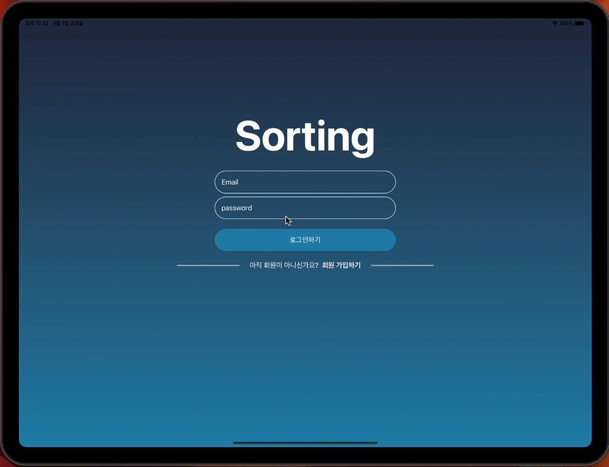

# 프로젝트 매니저
- 칸반 형태의 대시 보드를 통해서 간단한 할일에 대해서 관리 할 수 있습니다.
- Drag & Drop을 통해서 쉽게 프로젝트의 상태를 변경할 수 있습니다.
- 로그인 기능을 통해서 나만 열어볼 수 있습니다.

## 📖 목차
1. [팀 소개](#-팀-소개)
2. [개발 환경 및 라이브러리](#-개발환경-및-라이브러리)
3. [기능 소개](#-기능-소개)
4. [Diagram](#-diagram)
5. [폴더 구조](#-폴더-구조)
6. [타임라인](#-타임라인)
7. [프로젝트에서 경험하고 배운 것](#-프로젝트에서-경험하고-배운-것)
8. [트러블 슈팅](#-트러블-슈팅)
9. [참고 링크](#-참고-링크)

## 🌱 팀 소개
|[미니](https://github.com/leegyoungmin)|
|:---:|
| <a href="https://github.com/leegyoungmin"></a>|

## 💾 개발환경 및 라이브러리
| UI | Architecture |
|----|----|
||

| Local DataBase | Remote DataBase |
| ----|----|
||  |

## 기술적 도전
- [X] TCA 아키텍쳐 적용
- [X] FireStore 활용한 데이터 CRUD
- [X] Custom `UTType` 을 활용한 Drag / Drop 기능
- [X] FireBase Auth를 활용한 이메일 / 비밀번호 인증 시스템

## 🛠 기능 소개
### 1. 인증 시스템
| 로그인 |
|----|
||

| 회원 가입 |
|----|
||


### 2. 프로젝트 관리
| 프로젝트 생성 |
|----|
||

|프로젝트 상태 변경|
|----|
||

| 프로젝트 삭제 |
|----|
||

| 프로젝트 상태 업데이트|
|----|
||
## 👀 Diagram


## 🗂 폴더 구조
```bash
# 프로젝트 특성에 따라서 뷰와 관련된 파일은 삭제
├── App
│   ├── AppView
│   │   ├── AppCore.swift
│   │   └── ProjectManagerAppView.swift
│   ├── NetworkManager.swift
│   └── ProjectManagerApp.swift
├── AuthScene
│   ├── AuthCore.swift
│   ├── SignInView
│   │   └── SignInCore.swift
│   └── SignUpView
│       └── SignUpCore.swift
├── BoardScene
│   ├── BoardSceneCore.swift
│   ├── BoardListView
│   │   └── BoardListCore.swift
│   ├── BoardView
│   │   └── BoardCore.swift
│   ├── DetailBoardView
│   │   └── DetailCore.swift
│   └── NavigationView
│       └── NavigationBarCore.swift
├── Clients
│   ├── AuthClient.swift
│   ├── ProjectsClient.swift
│   ├── CoreDataManager
│   │   ├── CoreDataManager.swift
│   └── Proxy
│       ├── ProjectProvider + FireStore.swift
│       └── ProjectProvider.swift
└── Model
    ├── Project+Providable.swift
    ├── Project.swift
    └── User.swift
```
## 🕰️ 타임라인
|날짜|구현 내용|
|--|--| 
|23. 03. 22|TCA 라이브러리 버전 업데이트 및 기본 설정 변경|
|23. 03. 23 ~ 24|기존 기능 TCA Reducer Protocol에 맞춰서 리팩토링|
|23. 03. 25|Core Data 저장 및 읽기 기능 구현|
|23. 03. 27|FireBase 설치 및 Auth 기능 구현 (회원가입, 로그인)|
|23. 03. 28|Auth 기능 리팩토링|
|23. 03. 29|FireStore 저장 기능 생성|
|23. 03. 31|네트워크 감지 기능 구현|
|23. 04. 04|Core Data와 FireStore 클래스 병합 (Proxy 패턴)|
|23. 04. 07|버그 수정|

## 🤔 고민한 점
### 1. 기술 선정에 대한 고민


1. `SwiftUI`는 `UIKit`과 다르게 선언적 구문을 활용하여 UI를 구성하게 된다. 기존의 이벤트 중심 프로그래밍에서 선언적 구문을 활용하기에 코드가 간결해지고, 가독성이 향상되어 개발 기간을 단축시킬 수 있다.
2. `SwiftUI`는 데이터에 대한 상태 변경에 따라서 뷰를 다시 재 랜더링하는 구조를 가지고 있다. 이는 Binding에 대한 개념이 탑재가 된 것이고, 하나의 원천적인 데이터를 지속적으로 활용할 수 있는 부분이 메모리상에서 성능적 이점을 가지게 된다.
3. `SwiftUI`는 코드 작성의 원칙으로 뷰의 계층 구조와 비슷한 형태의 코드를 가질 수 있도록 하였기 때문에 코드 작성 속도가 빠르다.
4. 상태 관리 매커니즘을 기반으로 하며, 주어진 상태 객체의 속성이 변경되면, 이를 통해서 뷰를 다시 랜더링 하게된다. 뷰가 상태값에 대해서 바인딩을 하기때문에 상태 전달 코드가 줄어들게 된다.


다음 아키텍쳐는 ['SwiftUI에서 MVVM을 지양해야 한다.' 라고 생각하게 된 이유](https://qiita.com/karamage/items/8a9c76caff187d3eb838) 라는 문서를 읽어보면서 알게 되었다. 해당 문서에서 이야기하는 부분은 MVVM을 기존에 채택했던 이유에 대해서 이야기 하고 있다. `MVVM`이란 뷰와 뷰모델이 바인딩이라는 작업을 통해서 상태값에 대한 유연한 업데이트를 하는 것으로 이야기 할 수 있다.

하지만, SwiftUI는 View 자체에 이미 바인딩의 기능을 포함하고 있다. 즉, `SwiftUI`의 뷰들의 집합만으로도 `ViewModel`이 하던 바인딩의 작업을 수행할 수 있다. 그렇기 때문에 `ViewModel`의 존재 이유가 없다.

그렇다면, 이런 `MVVM`을 활용하지 않는다면, 어떻게 비즈니스 로직과 뷰를 구분할 수 있을까에 대한 의문이 들었다. 규모가 크지 않은 앱의 경우에는 `MV`만으로도 앱을 구성하는 데 문제가 없을 것이다. 이를 해결하기 위해서 `MVI`라는 아키텍쳐를 통해서 해결할 수 있습니다.

<image src = "https://i.imgur.com/G9zAssf.png" height = 300/>

MVI 아키텍쳐란 단방향 데이터 아키텍쳐로서 사용자의 이벤트를 받은 뷰가 `Intent`라는 객체에게 전달하여 모델의 상태 값을 변화시키고 이에 대해서 뷰가 업데이트할 수 있도록 하는 것이다.

### 2. Reducer의 구조
`Reducer` 들의 구조는 상향식으로 의존을 하는 구조를 구성할 수 밖에 없다. 그렇기 때문에 좋은 구조를 구성하기 위해서는 최대한 작게 만들고, 이들의 조합을 통해서 새로운 `Reducer`를 구성하는 것이 좋다. 작은 `Reducer`를 구성하는 것에 대해서 많은 고민을 했다. 하지만, 명확한 답을 내지는 못했다. 어느정도의 수준이 작은 `Reducer`라고 이야기할 수 있는지에 대해서는 개인 편차가 있을 것 같다고 판단하였다. 그래서 나는 해당 뷰가 어떤 기능을 가져야 하는지 명세화를 하고, 뷰와의 어떤 상호작용이 발생해야 하는지에 대해서 먼저 고민을 했다.

## 🚀 트러블 슈팅

### 화면 상태 변경에 따른 잘못된 뷰 노출


해당 버그는 사용자가 버튼을 누르는 시점에 따라서 상태의 변경을 하지 못하는 경우에 발생하게 되었다. `sheet(item:)` 메서드를 통해서 선택된 객체의 `State` 를 생성하는 코드에서 해당 `State` 가 외부적으로 상태가 변경되고, 외부에서 액션의 발생으로 상태를 지우는 것이 문제였다. `ifLetElse` 메서드는 상태의 존재 여부에 따라서 뷰를 다른 뷰를 보여주는 메서드이다.

이를 해결하기 위해서 `sheet(isPresent:)` 메서드를 활용하여서 개별적으로 사용할 수 있는 내부적인 액션을 구현하였다. `State` 내에서 보여주어야 한다는 상태값이 `true`와 `false`로 가지게 되었고, 뷰의 내부에서 `ifLet` 메서드를 통해서 상태값이 있는 경우에 뷰를 보여 줄 수 있게 구현하였습니다.

### 2. TextField의 PlaceHolder 색상 변경하기


`TextField` 내부 `Placeholder` 의 색상을 변경하는 `Modifier` 는 아직 지원하지 않는다. 그래서 색상을 변경하기 위해서 많은 시행착오를 하게 되었다. 이를 해결하기 위해서 `Custom Modifier` 를 구현하였다. 다음 코드를 통해서 해당되는 `Content` 에 대해서 `ZStack`과 `Opacity` 값을 조절하여서 뷰를 그릴 수 있도록 하였다. 이때, 해당되는 `TextField` 의 값이 존재하는 것을 `Binding` 객체로 받음으로써 `PlaceHolder` 의 뷰를 조절하였다.

```swift
extension View {
    func placeholder<Content: View>(
        when shouldShow: Bool,
        alignment: Alignment = .leading,
        @ViewBuilder placeholder: () -> Content
    ) -> some View {
        ZStack(alignment: alignment) {
            placeholder().opacity(shouldShow ? 1 : 0)
            self
        }
    }
    
    func placeholder(
        _ text: String,
        when shouldShow: Bool,
        alignment: Alignment = .leading
    ) -> some View {
        placeholder(when: shouldShow, alignment: alignment) {
            Text(text).foregroundColor(.white)
        }
    }
}
```


## 🔗 참고 링크
[SwiftUI에서 MVVM 사용을 멈춰야 하는가?](https://green1229.tistory.com/267)

[MVI 패턴과 어울리는 SwiftUI 화면 이동 라이브러리 만들기](https://www.youtube.com/watch?v=rq8KB21d7jQ&start=298)

[아직도 MVVM? 이젠 MVI 시대](https://sungbin.land/%EC%95%84%EC%A7%81%EB%8F%84-mvvm-%EC%9D%B4%EC%A0%A0-mvi-%EC%8B%9C%EB%8C%80-319990c7d60)
